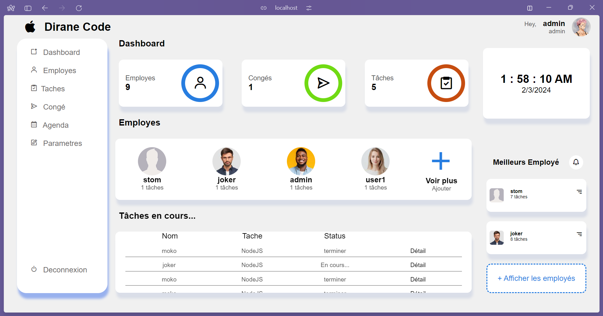

1-clone le projet dans le répertoire www de wamp ou dans htdocs de xampp
2-creer une base de donnée avec le nom gestiont_des_taches dans ton ordinateur (ex: phpMyAdmin)
3-importe la base de donnée se trouvant dans le projet
4-rends toi dans le navigateur à l'adresse localhost/gestiont_des_employes

Nb: login:admin & password:admin

